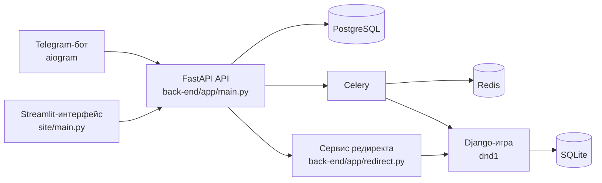

# TalentFrame

`TalentFrame` — мультисервисный прототип платформы для оценки кандидатов, в которой классические этапы отбора объединены с игровой механикой. Проект автоматизирует работу с вакансиями и кандидатами, проводит первичную проверку резюме, техническое интервью через Telegram-бота и оценивает гибкие навыки на основе поведения пользователя в игровой DnD-сессии.

Проект разработан в рамках хакатона «Подземелья и Драконы» от академии ИИ (https://ai-academy.ru/events/hakaton-podzemelya-i-drakony/).

## Назначение

Система решает две задачи:

- автоматизирует базовый рекрутинговый конвейер для компании;
- добавляет игровой сценарий для поведенческой оценки кандидата.

На практике это выглядит так:

1. Компания создаёт вакансию и загружает требования.
2. Кандидат проходит сценарий в Telegram-боте.
3. Система оценивает резюме и ответы на технические вопросы.
4. Кандидат переходит в игровую DnD-сессию.
5. История игры используется как источник сигналов для оценки гибких навыков.
6. Итоговый балл собирается в единый результат.

## Основные возможности

- регистрация компаний и хранение вакансий;
- регистрация кандидатов через Telegram;
- семантическая оценка резюме относительно требований вакансии;
- генерация и проверка технических вопросов;
- запуск игровой веб-сессии для оценки гибких навыков;
- формирование общего балла кандидата;
- интерфейс работодателя для просмотра результатов.

## Архитектура

Проект состоит из четырёх прикладных сервисов и двух слоёв хранения данных.



### Сервисы

- `tg_bot` — Telegram-бот на `aiogram`, через который кандидат проходит основную часть сценария.
- `back-end` — API на `FastAPI`, которое управляет пользователями, вакансиями, скорингом и интеграцией с игрой.
- `back-end/app/celery_app.py` — асинхронные задачи для расчёта резюме и гибких навыков.
- `dnd1` — Django-приложение с игровой логикой, картой, историей кампании и генерацией игровых сущностей.
- `site` — интерфейс работодателя на `Streamlit` для просмотра результатов и управления вакансиями.

### Хранилища

- `PostgreSQL` используется для рекрутинговой части:
  пользователи, вакансии, требования, кандидаты, промежуточные и итоговые оценки.
- `SQLite` внутри `dnd1` используется для игрового состояния:
  кампании, сущности, карта, история партии, игровые объекты.
- `Redis` используется как брокер и backend для `Celery`.

Это важная особенность текущей реализации: проект использует раздельное хранение бизнес-данных и игрового состояния.

## Сценарий работы системы

### 1. Работа компании

Компания регистрируется в системе и через `Streamlit` создаёт вакансию. В описание вакансии загружается текст требований, который потом используется как опорный документ для ML-оценки.

### 2. Работа кандидата

Кандидат взаимодействует с Telegram-ботом:

- регистрируется;
- выбирает компанию;
- выбирает вакансию;
- отправляет резюме;
- проходит техническое интервью;
- получает ссылку на игровую DnD-сессию.

### 3. Игровой этап

После запуска игры API либо создаёт новую кампанию, либо добавляет пользователя в существующую. Сервис редиректа передаёт пользователя в Django-игру, а после завершения игрового этапа фоновая задача получает историю комнаты и рассчитывает оценку гибких навыков.

### 4. Итоговая оценка

В текущей реализации итоговая оценка считается как среднее арифметическое трёх компонентов:

- `resume_score`
- `hard_skills_score`
- `soft_skills_score`

## ML-часть

ML-логика распределена между `back-end/app/ml.py`, `tg_bot/ml.py` и `dnd1/DnD_AI/functions_AI.py`.

### Оценка резюме

Файл: `back-end/app/ml.py`

Текущая схема:

1. Для вакансии берётся текст требований.
2. Для кандидата берётся текст резюме.
3. Оба текста преобразуются в эмбеддинги локальной моделью `E5-Mistral-7B-Instruct` в формате `GGUF`.
4. Сходство считается через косинусное сходство.

Используемый стек:

- `llama-cpp-python`
- `huggingface_hub`
- `torch`
- модель `second-state/E5-Mistral-7B-Instruct-Embedding-GGUF`

Фактически это семантическое сопоставление между описанием вакансии и содержанием резюме.

### Оценка технических навыков

Файл: `tg_bot/ml.py`

Текущая логика состоит из трёх шагов:

1. Генерируется роль, наиболее близкая к вакансии.
2. Генерируется следующий технический вопрос по истории уже заданных вопросов и по описанию вакансии.
3. Для этого же вопроса строится эталонный ответ, после чего ответ кандидата сравнивается семантически.

Особенности реализации:

- при наличии `OPENAI_API_KEY` используется API-модель из `OPENAI_CHAT_MODEL`;
- без внешнего API возможен локальный режим через `gemma-2-27b-it` в формате `GGUF`;
- для итогового сравнения ответов используется эмбеддинговая модель `E5-Mistral`;
- для русскоязычных ответов предусмотрен перевод в английский перед сравнением.

Таким образом, блок оценки технических навыков устроен не как проверка по точным шаблонам, а как семантическое сопоставление ответа кандидата с модельным эталоном.

### Оценка гибких навыков

Файлы: `back-end/app/ml.py`, `back-end/app/celery_app.py`

Гибкие навыки вычисляются после игрового этапа:

1. Из текста вакансии LLM генерирует список желательных гибких навыков.
2. Из истории игровой сессии LLM извлекает наблюдаемые поведенческие признаки кандидата.
3. Два текста снова приводятся к эмбеддингам.
4. Итоговая оценка считается через косинусное сходство.

Источник данных для оценки:

- история комнаты из Django-игры;
- имя пользователя;
- текст требований вакансии.

Это даёт проекту отдельный поведенческий сигнал, который не зависит напрямую от резюме и технических вопросов.

### Генерация игрового контента

Файл: `dnd1/DnD_AI/functions_AI.py`

В игровом модуле используются:

- `OpenAI DALL-E 3` для генерации изображений;
- `Stable Diffusion XL` через Hugging Face API как запасной вариант;
- `LangChain + OpenAI` для генерации и продолжения игровых сюжетов;
- `Gemini` как дополнительный AI-провайдер для текстовых сценариев.

Генерация используется для:

- стартовых историй кампании;
- описаний мира;
- продолжения повествования;
- иллюстраций персонажей и сцен.

### Работа с голосом

Распознавание речи реализовано в `back-end/app/main.py` и частично в `tg_bot/stt.py`.

Текущий стек:

- `ffmpeg` для перекодирования входящего аудио;
- `Vosk` для офлайн-распознавания;
- `speechbrain` загружен для определения языка;
- в API есть маршрут `/transcribe_audio` для преобразования голосового сообщения в текст.

Это позволяет использовать голосовые ответы как часть сценария интервью.

## Техническая структура репозитория

```text
ai_arrow_hack/
├── back-end/
│   ├── alembic/
│   └── app/
├── dnd1/
│   ├── DnD_AI/
│   ├── Project/
│   ├── media/
│   └── static/
├── examples/
├── requirements/
├── site/
├── tg_bot/
├── .env.example
├── docker-compose.yml
├── Makefile
└── requirements.txt
```

## Технологический стек

- `Python 3`
- `FastAPI`
- `Django`
- `Streamlit`
- `Aiogram`
- `Celery`
- `Redis`
- `PostgreSQL`
- `SQLite`
- `llama-cpp-python`
- `PyTorch`
- `OpenAI API`
- `Google Gemini`
- `Hugging Face Inference API`
- `Vosk`

## Быстрый старт

### Системные требования

- `Python 3.10+`
- `ffmpeg`
- `Docker` и `Docker Compose`
- доступ в интернет при первом запуске локальных моделей, если нужные веса ещё не скачаны

### 1. Подготовка окружения

```bash
python3 -m venv .venv
source .venv/bin/activate
cp .env.example .env
```

### 2. Установка зависимостей

Установка всех зависимостей:

```bash
pip install -r requirements.txt
```

Установка зависимостей по сервисам:

```bash
pip install -r requirements/game.txt
pip install -r requirements/backend.txt
pip install -r requirements/bot.txt
pip install -r requirements/site.txt
```

### 3. Поднятие инфраструктуры

```bash
docker compose up -d postgres redis
```

### 4. Запуск сервисов

Игровой модуль:

```bash
cd dnd1
python3 manage.py runserver 0.0.0.0:7000
```

API-сервис:

```bash
cd back-end/app
uvicorn main:app --reload --host 0.0.0.0 --port 8000
```

Сервис редиректа:

```bash
cd back-end/app
uvicorn redirect:app1 --reload --host 0.0.0.0 --port 10000
```

Telegram-бот:

```bash
cd tg_bot
python3 bot.py
```

Интерфейс работодателя:

```bash
cd site
streamlit run main.py --server.port 8501
```

## Конфигурация

Ключевые параметры задаются через `.env`.

### Инфраструктура

- `DATABASE_URL` — подключение к `PostgreSQL`
- `REDIS_URL` — подключение к `Redis`
- `POSTGRES_USER`, `POSTGRES_PASSWORD`, `POSTGRES_DB`, `POSTGRES_PORT` — параметры контейнера БД
- `REDIS_PORT` — внешний порт `Redis`

### Сервисы

- `BACKEND_URL` — адрес FastAPI API
- `REDIRECT_PUBLIC_URL` — публичный URL сервиса редиректа
- `GAME_PUBLIC_URL` — публичный URL игрового Django-модуля
- `FRONTEND_ORIGINS` — список разрешённых источников для CORS

### Django

- `DJANGO_SECRET_KEY`
- `DJANGO_DEBUG`
- `DJANGO_ALLOWED_HOSTS`

### Интеграции и ML

- `TELEGRAM_BOT_TOKEN`
- `OPENAI_API_KEY`
- `HF_API_KEY`
- `GEMINI_API_KEY`
- `OPENAI_CHAT_MODEL`

## Команды из корня проекта

```bash
make up-infra
make run-game
make run-backend
make run-redirect
make run-bot
make run-site
```

## Пример входных данных

В [examples/job_requirements.txt](examples/job_requirements.txt) лежит пример описания вакансии, которое можно использовать для локального тестирования сценария.

## Ограничения текущей версии

- проект остаётся хакатонным прототипом и не готовился под промышленную эксплуатацию;
- игровая и рекрутинговая части используют разные хранилища;
- часть ML-логики зависит от внешних API и/или локально загружаемых моделей;
- итоговый скоринг сейчас строится на сравнительно простой агрегации трёх числовых метрик;
- в коде ещё нет полноценного набора тестов и унифицированной схемы конфигурации для всех сценариев запуска.

## Статус

Текущая версия — рабочий исследовательский прототип, ориентированный на демонстрацию идеи: связать рекрутинговый процесс, LLM-оценку и игровую механику в одном сценарии отбора.
